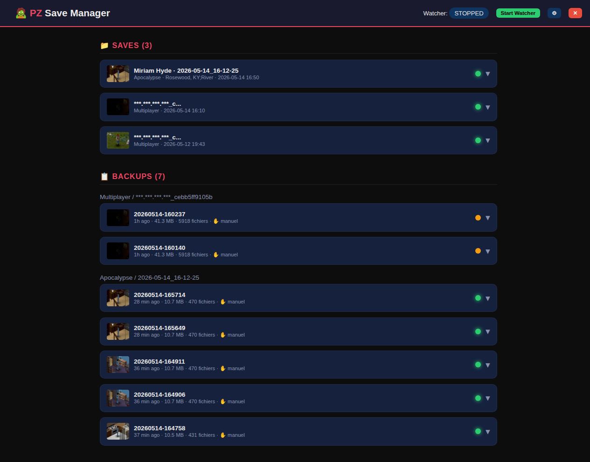
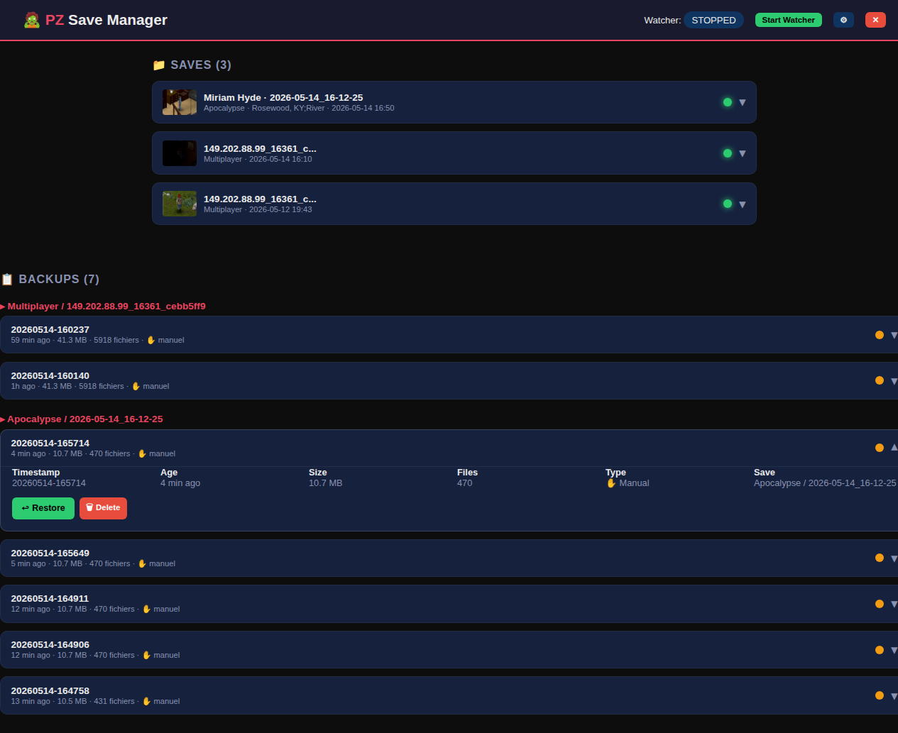

# 🧟 PZ Save Manager

> Backup manager for Project Zomboid — automatic, visual, effortless.

Never lose a save again. PZ Save Manager watches your Zomboid saves and creates
timestamped backups automatically. Restore any version in one click from a
clean web interface.


## Features

- **🔄 Auto-backup** — detects save changes and creates backups automatically
- **🖼️ Visual preview** — shows the in-game thumbnail for each save
- **📊 Save insights** — player name, status (alive/dead), position, vehicles, mods, map chunks
- **⚙ Configurable** — set custom backup directory, debounce delay, port
- **🖥️ Web GUI** — clean dark-themed interface, works in any browser
- **🚀 One-click launch** — `.bat`/`.sh` launchers, no terminal needed
- **🌍 Cross-platform** — Windows, Linux, macOS

## Screenshots



*Compact cards with status indicator, thumbnail, and one-click actions.*



*Expanded view showing player info, stats, backup history, and restore options.*

## Quick Start

### Windows — prebuilt .exe (recommended)

No Python install needed:

1. Go to [Releases](https://github.com/chpomob/pz-save-manager/releases/latest)
2. Download `pz-save-manager.exe`
3. Double-click — the web UI opens in your browser → done!

> First launch may take a few seconds (the exe unpacks itself). Windows SmartScreen may warn about an unsigned binary — click "More info" → "Run anyway".

### Windows — from source

Use this only if you want to modify the code. Requires Python 3.10+ from <https://www.python.org/downloads/> (**not** the Microsoft Store — that's a stub that can't create virtual environments). During install, tick **"Add python.exe to PATH"**. Then download/clone the project, double-click `launcher.bat`, and the first run installs dependencies automatically.

If a previous run left a broken `.venv` folder, delete it before retrying.

### Linux / macOS

```bash
git clone https://github.com/chpomob/pz-save-manager.git
cd pz-save-manager
./launcher.sh
```

The first run installs everything automatically. Open http://127.0.0.1:8080.

### Install desktop shortcut

```bash
pz-saves install
```

Adds a menu entry so you can launch it like any other app.

## How It Works

```
~/Zomboid/Saves/                   ~/.pz-save-manager/backups/
├── Apocalypse/                    ├── Apocalypse/
│   └── my-world/    ──watch──▶    │   └── my-world/
├── Survivor/                      │       ├── 20260514-160140/
│   └── other/                     │       ├── 20260514-160905/
└── ...                            │       └── ...
                                   └── ...
```

The watcher monitors your save directory. When Project Zomboid writes save files,
the watcher waits 5 seconds (configurable), then snapshots the entire save.

## Commands

| Command | Description |
|---------|-------------|
| `pz-saves gui` | Launch the web interface |
| `pz-saves list` | List all saves in the terminal |
| `pz-saves backup <mode> <name>` | Manual backup (CLI) |
| `pz-saves restore <mode> <name> <ts>` | Restore a backup (CLI) |
| `pz-saves rename <mode> <old> <new>` | Rename a save (moves backups too) |
| `pz-saves annotate <mode> <save> <ts> [note]` | Add/read a note on a backup |
| `pz-saves config` | View/set configuration |
| `pz-saves install` | Create desktop shortcut |

## Configuration

```bash
pz-saves config backups_dir /media/external/pz-backups   # Custom backup location
pz-saves config debounce_seconds 10                       # Wait 10s before auto-backup
```

Or use the ⚙ settings panel in the web UI.

## Development

```bash
git clone https://github.com/chpomob/pz-save-manager.git
cd pz-save-manager
python3 -m venv .venv
.venv/bin/pip install -e ".[dev]"
.venv/bin/pytest                    # 62 tests
```

## Tech Stack

- **Python 3.10+** — zero external runtime dependencies
- **Flask** — web server
- **watchdog** — file system monitoring
- **Click + Rich** — CLI
- **SQLite** — save data extraction (stdlib)

## FAQ

### Why isn't this a Project Zomboid mod?

Short answer: **PZ's Lua modding sandbox doesn't allow file I/O.**

Project Zomboid uses Kahlua, a Lua interpreter embedded in Java, which **does not implement the standard `io.*` and `os.*` modules**. This means a mod running inside PZ cannot:
- Copy or move files and directories
- Create or delete folders
- List directory contents
- Run external processes
- Open SQLite databases

All of PZ Save Manager's core features — atomic backups, file watching, metadata extraction from `players.db` — require these filesystem operations. They are simply impossible from inside the game.

The few backup mods that exist on Steam Workshop (e.g. "PZ Backup Manager") use the exact same architecture as this app: a **Lua mod for in-game UI + an external Windows application** that does the actual file work.

### Why not make it a mod companion instead?

A small Lua mod could communicate with PZ Save Manager (e.g. via a local HTTP endpoint) to add in-game features:

| Feature | Mod companion | Standalone app (current) |
|---------|:---:|:---:|
| Backup automation (watcher) | ❌ needs external app | ✅ built-in |
| Web UI (any browser, any OS) | ❌ | ✅ Flask GUI |
| Cross-platform (Win/Linux/Mac) | ❌ Lua only, external app Windows-only in practice | ✅ Python |
| CLI automation (scripts, cron) | ❌ | ✅ Click CLI |
| Testability / CI | ❌ needs game running | ✅ pytest |
| You can modify / extend it | ❌ needs Lua + Java decompile | ✅ Python |
| In-game notifications | ✅ | ❌ |
| Hotkey to trigger backup | ✅ (with companion app) | ❌ |
| Auto-backup on player death | ✅ (with companion app) | ❌ (watcher only) |

The standalone approach is **more powerful, cross-platform, testable, and maintainable**. An optional mod companion could be added later for in-game convenience (hotkeys, notifications), but the core — backup, restore, metadata, web UI — will always live outside the game sandbox.

### So how do I use it with PZ?

You don't need to do anything special. PZ Save Manager runs **alongside** the game — launch it before playing, and it watches your save directory automatically. No mod installation, no Steam Workshop, no game file modifications. It works with any PZ build, any mod setup, multiplayer included.

## License

MIT — do whatever you want with it.

## Changelog

### v0.1.5 — 2026-05-26

- **Fix**: `.pz-auto`/`.pz-note` sidecars no longer leak into live saves during restore
- **Fix**: Rename is now safe — preflight checks backups before touching the save
- **Fix**: Watcher timers are cancelled on stop/unwatch, preventing ghost backups
- **Fix**: Race condition in `_do_backup()` — locked state access for cooldown/mtime
- **Chore**: Bumped test suite from 16 → 47 tests
- **Meta**: Full Codex review in `docs/codex-review.md`

### v0.1.4 — 2026-05-18

- **Fix**: Default cooldown 1min, handle `max_auto_backups=0` correctly
- **Fix**: Use local time for backup timestamps (was UTC, causing 2h offset)
- **Fix**: Use `os._exit(0)` as last-resort shutdown fallback
